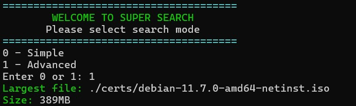

# Super Search 🔍




A simple Bash script to find the largest file in a directory.

## 📌 Description

Super Search allows you to:

- Scan only the current directory
- Scan all subdirectories (recursive search)
- Display the largest file found
- Show the file size in human-readable format

---

## ⚙️ Requirements

- `find`
- `stat`
- `numfmt`

---

## 🚀 Usage

Make the script executable:

```bash
chmod +x super-search.sh
